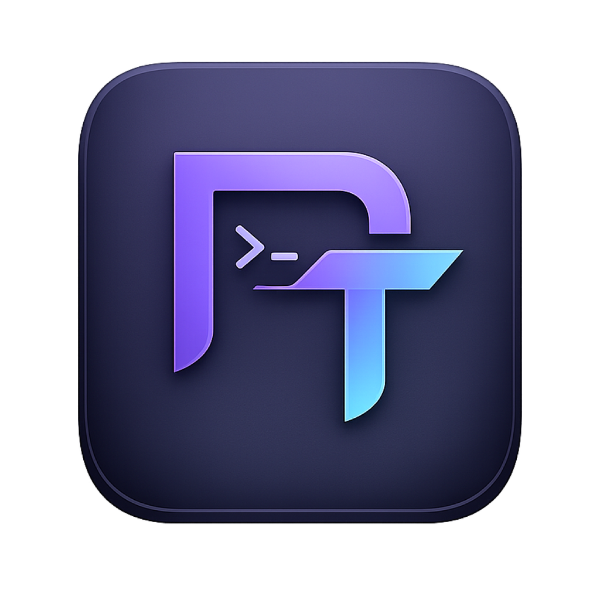

# PHP Tinker



PHP Tinker is an offline Electron scratchpad for running PHP and JavaScript. It can work with bare PHP, Composer projects, Laravel applications, and optional SSH connections. The desktop app has no account, license check, analytics service, or required backend.

[Source](https://github.com/TechyMS/phptinker) · [Releases](https://github.com/TechyMS/phptinker/releases) · [Issues](https://github.com/TechyMS/phptinker/issues) · [MIT License](LICENSE)

## Project status

The desktop source is open source. Publishing the source is separate from approving a signed, multi-platform binary release. Intel macOS desktop and copied-installer smoke tests have been exercised locally. Native Apple silicon and Windows CI desktop smoke tests and installer builds have also passed. Linux tests, sandboxed desktop checks, and AppImage/Debian package builds have passed in a local Ubuntu 24.04 container. Linux CI startup requires the sandbox setup described below; installer acceptance on end-user systems still needs verification. Signing/notarization and real SSH/Laravel workflow acceptance checks also remain outstanding.

## Features

- Run PHP snippets with REPL-style last-expression output.
- Load Composer autoloaders or boot a Laravel console kernel.
- Run JavaScript with the Node runtime bundled in Electron.
- Keep multiple tabs connected to different local or SSH projects.
- Index Composer classes for PHP autocomplete without executing generated Composer PHP maps.
- Stream output and stop executions that exceed 30 seconds or 16 MiB of captured output.

## Install a desktop build

When published, download the package for your operating system and CPU architecture from [GitHub Releases](https://github.com/TechyMS/phptinker/releases). If no package is available yet, build from source using the instructions below. On macOS, use `arm64` for Apple silicon and `x64` for Intel Macs. Open the DMG and copy PHP Tinker to Applications before launching it.

The locally generated development packages are unsigned. macOS and Windows may therefore warn before opening them. Public releases should be signed (and notarized on macOS) by the person publishing the release.

PHP Tinker needs a working PHP CLI for PHP tabs. On first launch it automatically checks:

- the previously saved absolute path;
- executable files on the app's launch `PATH`;
- common Herd, Homebrew, system PHP, XAMPP, and PHP installation locations for the current operating system.

If PHP is elsewhere, open **Runtime Settings**, select the executable with **Browse**, or enter its absolute path. A blank or non-working path cannot be saved. JavaScript tabs need no separate Node installation.

## Quick start

1. Launch PHP Tinker and confirm that PHP is detected, or configure its executable in **Runtime Settings**. PHP is not bundled; install a compatible PHP CLI before using PHP tabs.
2. Open a PHP tab and enter a snippet without an opening `<?php` tag:

   ```php
   21 * 2
   ```

3. Click **Run**, or press **Cmd+Enter** on macOS / **Ctrl+Enter** on Windows and Linux. The last expression's value is displayed in the output pane.
4. For a trusted Composer or Laravel project, select its root folder after installing its dependencies. Composer mode loads `vendor/autoload.php`; Laravel mode also boots the console kernel. The PHP executable must support the selected project's PHP version and extensions.
5. For JavaScript, switch the tab's language and run:

   ```js
   console.log(21 * 2)
   ```

Optional SSH connections use your system OpenSSH client, keys, agent, and verified host keys. No SSH password entry or hosted backend is required.

## Data and privacy

All desktop state is local and per operating-system user. It is stored through Electron's `userData` directory in `phptinker.json`, with autocomplete caches in the adjacent `class-cache` directory:

- macOS: `~/Library/Application Support/phptinker/`
- Windows: `%APPDATA%\phptinker\`
- Linux: `$XDG_CONFIG_HOME/phptinker/`, normally `~/.config/phptinker/`

This state includes editor buffers, selected project paths, the PHP executable path, recent projects, and SSH connection metadata. Private keys and passwords are not copied into the app; SSH authentication is delegated to the system OpenSSH client and its agent/configuration.

Saved buffers and settings are local plaintext files, not an encrypted vault. Avoid pasting credentials or sensitive production data into buffers you do not want persisted.

PHP Tinker does **not** create or own an application database. A Laravel or Composer project's database remains wherever that project configures it. Connecting a project only stores its path in the current user's settings.

## Security model

Pressing **Run** intentionally executes the current buffer with your user account's permissions, and Composer/Laravel modes load the selected project's PHP bootstrap files. Only run code and projects you trust. SSH mode executes the buffer on the selected remote host.

Simply selecting a project may index its source for autocomplete, but the indexer reads JSON metadata and tokenizes PHP source; it does not `require`, `include`, or evaluate the project's generated Composer map files. See [SECURITY.md](SECURITY.md) for the full trust boundary and reporting process.

Indexing requires PHP's tokenizer extension. The scanner ignores `php.ini`; if tokenizer is a shared extension, it explicitly loads it from the selected PHP runtime's absolute default extension directory. A missing extension produces an actionable error rather than falling back to project configuration. The same isolation applies to SSH indexing.

Automatic indexing checks paths against the selected canonical project directory, including its in-tree vendor directory. External Composer path repositories and escaping symlinks are skipped; a warning explains skipped external roots. These checks are application-level hardening, not an operating-system filesystem sandbox. External code can still load when you explicitly Run a trusted project. Individual PHP sources over 2 MiB and Composer index metadata over 8 MiB are skipped, with a 64 MiB total read budget. Project validation parses at most 1 MiB of metadata.

SSH Test, indexing and Run require a previously verified host key in OpenSSH's `known_hosts`. Before first use, connect using your system SSH client and independently verify the host fingerprint with the server administrator before accepting it. Unknown or changed keys are not automatically accepted by this app.

On POSIX, the app tightens its data directory to `0700` and settings/cache files to `0600`, including existing settings. On Windows, data uses the current user's profile ACLs; no shared application database is created.

## Develop

Requirements:

- Node.js 22.12 or newer (the repository includes `.nvmrc`)
- npm
- PHP CLI for PHP integration tests and local PHP execution

```sh
git clone https://github.com/TechyMS/phptinker.git
cd phptinker
npm ci
npm run dev
```

For tests and a production build:

```sh
npm test
npm run build
npm run test:desktop
npm audit
```

`npm run check` combines unit/integration tests and the production build. Run `npm run build` before the actual desktop smoke test. Linux desktop tests require a graphical session or `xvfb-run -a npm run test:desktop`. PHP-dependent tests may skip when PHP is unavailable; skipped tests do not establish PHP compatibility.

The desktop smoke test requires successful PHP/JavaScript execution, safe indexing, private per-user settings, an isolated renderer, and working Monaco worker completions. It also attempts to save a diagnostic screenshot in its disposable data directory. Screenshot capture is best-effort and time-bounded: a headless display/compositor error is reported separately and does not bypass or fail those application checks. The blank-PHP-path error logged during this test is an intentional rejection check, followed by restoration of the working runtime.

Create desktop packages with:

```sh
npm run dist
```

Artifacts are written to `release/`. The macOS configuration creates DMG and ZIP packages for Intel (`x64`) and Apple silicon (`arm64`). Windows and Linux packages should be produced and tested on their native operating systems.

Build and distribution commands generate `THIRD_PARTY_NOTICES.txt` from the installed dependency license files. Packages include that notice file and the project's MIT `LICENSE`; Electron supplies its additional runtime licenses.

CI installs PHP, runs unit and actual Electron/Monaco smoke tests, and builds installers on macOS, Windows, and Linux. Linux smoke tests require a display (CI uses Xvfb). A configured workflow is not proof that those native runs have passed; inspect its results before publishing.

Ubuntu 24.04 can restrict unprivileged user namespaces. For source-based CI launches, the workflow downloads the selected Electron runtime first and configures its `chrome-sandbox` helper as root-owned with mode `4755`, then verifies those permissions. Electron's sandbox remains enabled; the workflow does not use `--no-sandbox` or disable host security policies. An installed Linux package must likewise provide a working sandbox on the user's system.

Known non-fatal build notices: Monaco's editor/language-service bundles exceed Vite's default web chunk-size threshold, and the installer builder currently brings deprecated `inflight`, `glob` 7, and `rimraf` 2 dependencies. These notices are not suppressed; dependency overrides across incompatible major versions should not be used merely to silence them. macOS runner-capacity notices are GitHub infrastructure advisories, not application failures.

## Contributing

Please read [CONTRIBUTING.md](CONTRIBUTING.md). By contributing, you agree that your contribution is licensed under the [MIT License](LICENSE).

Report ordinary bugs through [GitHub Issues](https://github.com/TechyMS/phptinker/issues), including your operating system, CPU architecture, app/PHP versions, reproduction steps, and sanitized error output. Follow [SECURITY.md](SECURITY.md) for security reports; do not publish vulnerability details or secrets in an issue.
